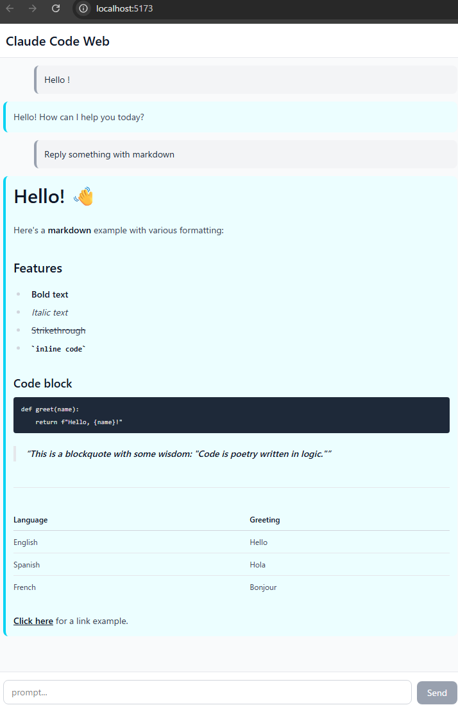

# Web app example

Web UI for `claude`.

(caution: it works as `permission_mode="bypassPermissions"`)

### usage

terminal 1:

```console
cd backend

uv sync

uv run uvicorn api:app --reload --port 8000
```

terminal 2:

```console
cd frontend

npm install

npm run dev
```

➜ http://localhost:5173/

### demo


